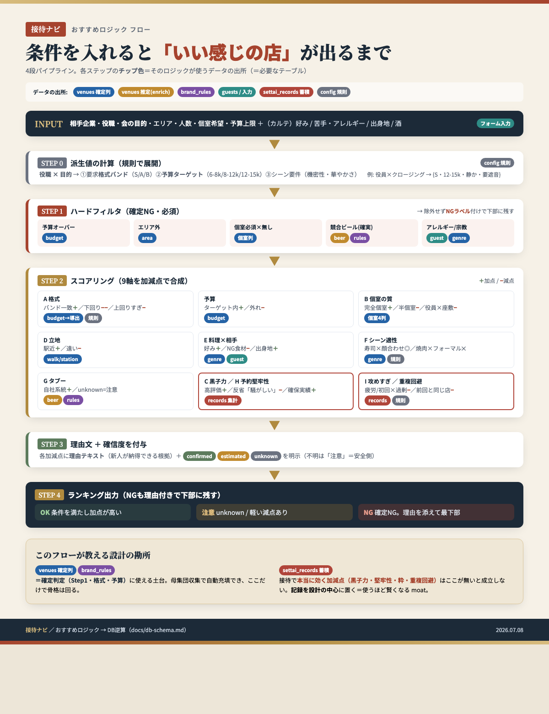

# 会食ナビ — おすすめロジック（判定フロー）

> このドキュメントは「条件を入れると **いい感じの店** が出るまで」の判定ロジックを、チームで共有するためにまとめたもの。
> データ構造の詳細は [`db-schema.md`](./db-schema.md)、根拠は [`research/settai-venue-selection-research.md`](./research/settai-venue-selection-research.md) を参照。

## フロー図（全体像）

---

## 設計思想（3つの原則）

1. **確定判定は薄く、加減点で"らしさ"を出す** — 機械で確実に取れるデータ（予算・立地・ジャンル・個室・競合ビール）は少ない。これだけで骨格を作り、会食の"効き"は加減点レイヤーで表現する。
2. **NG を除外せず、理由付きで下部に残す** — 落とすのでなく「なぜNGか」を見せる。新人の学びになり、最終判断は人間ができる。
3. **不明を不明として扱い、安全側に倒す** — 推定データには確信度（`confirmed` / `estimated` / `unknown`）を付け、確実な時だけ確定NG。`unknown` は「注意」止まり。

---

## 入力（RecommendQuery）

フォーム（＋相手カルテ）から供給される。判定の**発火条件**になる。

| 項目 | 例 | 主に効く軸 |
|---|---|---|
| 相手企業 | キリン | G タブー |
| 相手の役職 | 部長 / 役員 | A 格式・予算 |
| 会の目的 | 顔合わせ / 御礼 / クロージング / 謝罪 / 慰労 / 祝い | A・F・I |
| エリア / 人数 / 個室希望 / 予算上限 | 京橋 / 4名 / 要 / 〜2万 | フィルタ |
| （カルテ）好み・苦手・アレルギー・出身地・酒 | 甲殻類NG / 日本酒党 | E |
| （導出）相手が多忙・疲労 / 初回か | — | I「攻めすぎ」分岐 |

---

## パイプライン（4段）

### Step 0 — 派生値の計算〔config 規則〕

**役職 × 目的** から、判定の基準を規則で展開する（店データではなく、ルールエンジンの中身）。

- 要求**格式バンド**（S / A / B）
- **予算ターゲット**（顔合わせ 6–8k / 標準 8–12k / 重要 12–15k）
- シーン要件（機密性・華やかさ・遮音の要否）

> 例: 役員 × クロージング → `{格式=S, 予算=12–15k, 静か, 要遮音}`
> ※ この対応表の数値は**暗黙知ヒアリングで確定**する（現状は仮値）。

### Step 1 — ハードフィルタ（確定NG・必須）

必須条件を満たさない店に **NGラベル**を付ける（除外はせず下部に残す）。

| 条件 | 使うデータ |
|---|---|
| 予算オーバー | `venues.budget` |
| エリア外 | `venues.area` |
| 個室が必須なのに無い | `venues` 個室列 |
| 競合ビール（**確実な時のみ**） | `venues.beer_*` × `brand_rules` |
| アレルギー・宗教に確実に抵触 | `guests` × `venues.genre` |

### Step 2 — スコアリング（9軸を加減点で合成）

| 軸 | 効果（＋加点 / −減点） | 使うデータ |
|---|---|---|
| **A 格式** | バンド一致＋／下回り−−／上回りすぎ−（恐縮） | `budget→導出` ＋ 規則 |
| **予算** | ターゲット内＋／外れ− | `budget` |
| **B 個室の質** | 完全個室＋／半個室−／役員×座敷（正座）− | 個室4列 |
| **D 立地** | 駅近＋／遠い− | `walk_minutes` / `station` |
| **E 料理×相手** | 好み一致＋／NG食材該当−／出身地マッチ＋ | `genre` ＋ `guests` |
| **F シーン適性** | 寿司・懐石×顔合わせ◎／焼肉×フォーマル✕ | `genre` ＋ 規則 |
| **G タブー** | 自社系統＋／unknown=注意 | `beer_*` ＋ `brand_rules` |
| **C 黒子力** ／ **H 予約堅牢性** | 高評価＋／反省「騒がしい」等−／個室確保の実績＋ | `settai_records` 集計 |
| **I 攻めすぎ** ／ **重複回避** | 疲労・初回×過剰格式/予約困難−／前回と同じ店− | `settai_records` ＋ 規則 |

### Step 3 — 理由文 ＋ 確信度を付与

各加減点に**理由テキスト**（新人が納得できる根拠）を添え、`confirmed` / `estimated` / `unknown` を明示。不明は「注意」に落とす。

### Step 4 — ランキング出力

スコア降順。バッジで見せる。

- **OK** — 条件を満たし加点が高い
- **注意** — `unknown` や軽い減点あり
- **NG** — 確定NG。理由を添えて**最下部に残す**

---

## このロジックが教える設計の勘所（＝ moat）

- 🔵 **`venues` 確定列 ＋ 🟣 `brand_rules`** = 確定判定（Step1・格式・予算）の土台。母集団収集で自動充填でき、**ここだけで骨格は回る**。
- 🔴 **`settai_records` 蓄積** = 会食で**本当に効く加減点（黒子力・予約堅牢性・粋・重複回避）はここが無いと成立しない**。だから記録を「あとで足す」ではなく**設計の中心**に置く。使うほど賢くなる＝模倣困難な差別化。

---

## 未確定（暗黙知ヒアリングで詰める）

- 各軸の**重み**（どれを外すと一発アウトか）
- `role × purpose → 格式/予算` の対応表の数値
- `genre × purpose` のシーン適性スコア
- 「攻めすぎ」減点の発火しきい値

→ ヒアリングの設問は `research/settai-venue-selection-research.md §6`、進め方は `status.md` の次アクション参照。
